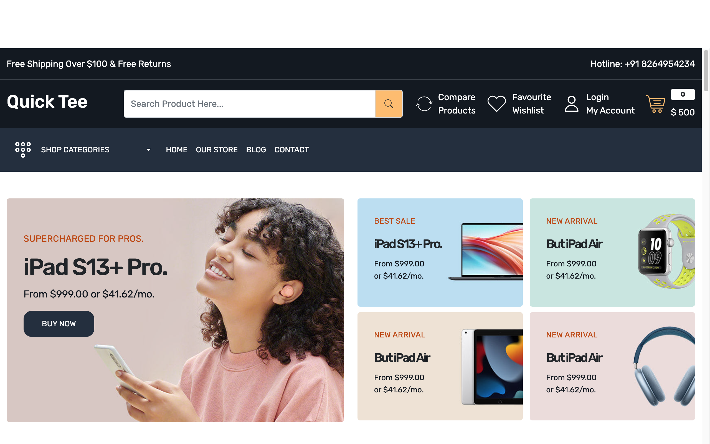
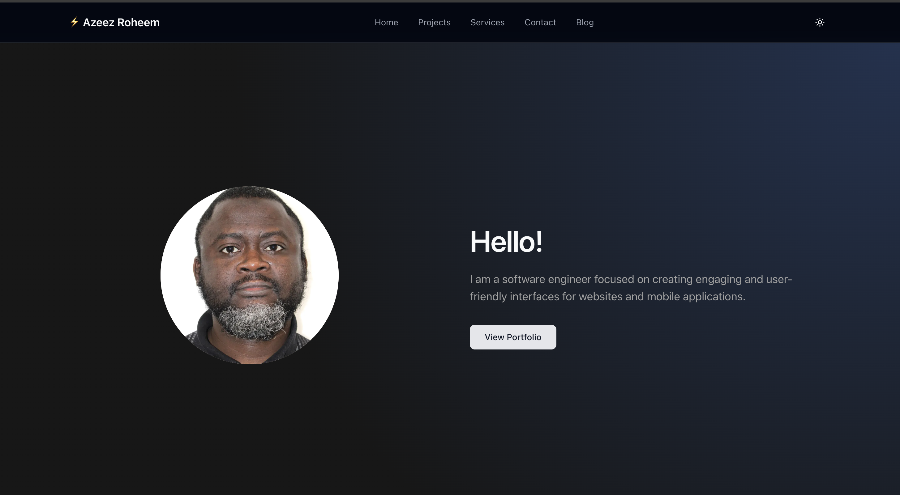
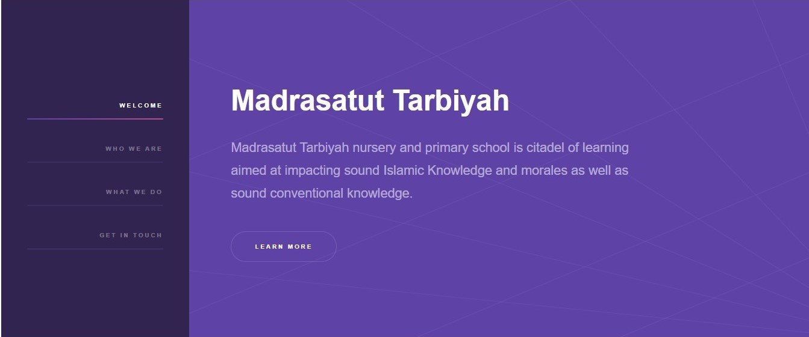

  
  
  
  
  

Hello! I'm Azeez, a full-stack JavaScript developer specialising in React, Next.js, Node.js and MongoDB, building scalable ecommerce systems and impact-driven digital products. Through freelance work and independent projects, I have delivered measurable business and social impact while contributing to the wider tech ecosystem.

See [my website](https://azeezroheem.dev) for more information!

<h1 align="center">Projects</h1>
<table bordercolor="#66b2b2">
  <td width="50%" valign="top">
      <h3 align="center">Quick Tee</h3>
         
        
         
        

          
    
  
      

        
<strong>MongoDB, Express, React and NodeJS</strong> - Quick Tee: Your Ultimate E-commerce Destination! Shop for your favorite items effortlessly with our full-stack application. Whether you register or dive straight into shopping, Quick Tee has you covered. Admins can seamlessly manage the inventory by creating, updating, and deleting items. Enjoy a smooth and dynamic shopping experience with Quick Tee!

    </td>
  <td width="50%" valign="top">
      <h3 align="center">Nanocrafts</h3>
         
      
         
        

          
  
  
      

        
<strong>
          HTML5, CSS3, Javascript, Next.js, Tailwind and Shadcn
        </strong> - Nanocrafts is a software consulting company. They build websites and web applications. They utilize modern technologies and resources to build applications.

    </td>
  <tr>
    <td width="50%" valign="top">
      <h3 align="center">Journal App</h3>
         
        
         
        

          
    
  
      

        
<strong>HTML5, CSS, Node.js, Express.js, & MongoDB</strong> - Insight Journal App is a web application that host the details of Star Trek characters. It is a full-stack application. Inputing the name of any one among the characters (like Vulcans) will respond with the brief details along with the picture.

    </td>
    <td width="50%" valign="top">
      <h3 align="center">Online Learning App</h3>
         
        
         
        

          
    
  
      

        
<strong>HTML5, CSS, Node.js, Express.js, & MongoDB</strong> - Online Learning App is a web application where students and teachers interact to study and review lessons. It is a full-stack application.

    </td>
  </tr>
  
  <tr>
    <td width="50%" valign="top">
      <h3 align="center">AzeezRoheem</h3>
       
        
       
        

  
  
      

        
<strong>HTML5, CSS3, Javascript, Next.js, Tailwind and Shadcn</strong> - Portfolio Site including links to my projects and ways to get in contact with me.

    </td>
    <td width="50%" valign="top">
      <h3 align="center">Madrasatut Tarbiyah</h3>
         
        
         
        

          
  
  
      

        
<strong>HTML5, CSS3, & Javascript</strong> - Madrasatut Tarbiyah nursery and primary school is citadel of learning aimed at impacting sound Islamic Knowledge and morales as well as sound conventional knowledge.

    </td>
    </tr>
</table>

<h1 align="center">Technologies</h1>

    
    
    <!-- 
     -->
    
    
    
    
    <!--  -->
    <!-- 
     -->
    
    
    
    
    
    
    
    
    
    
    

---

<h1 align="center">Connect</h1>

  
  
  
  
  

