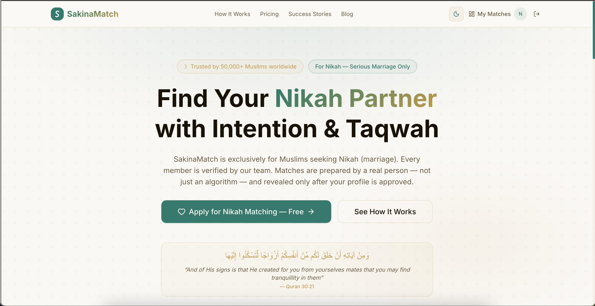
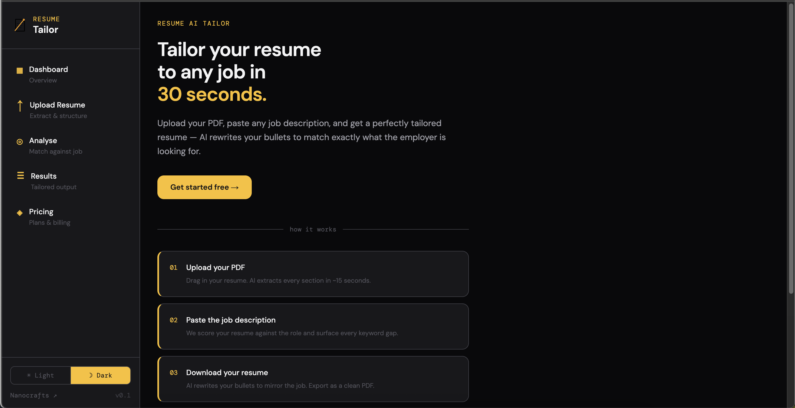
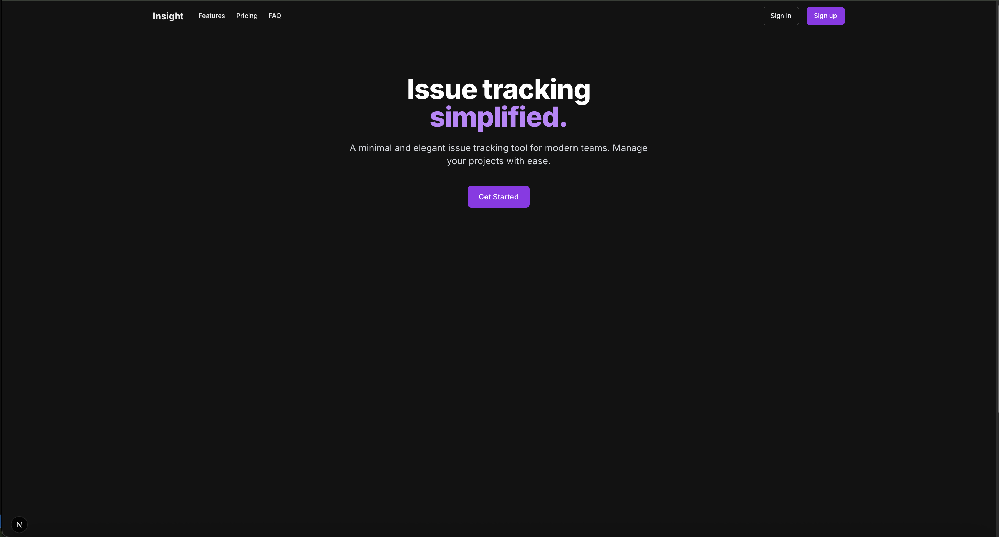
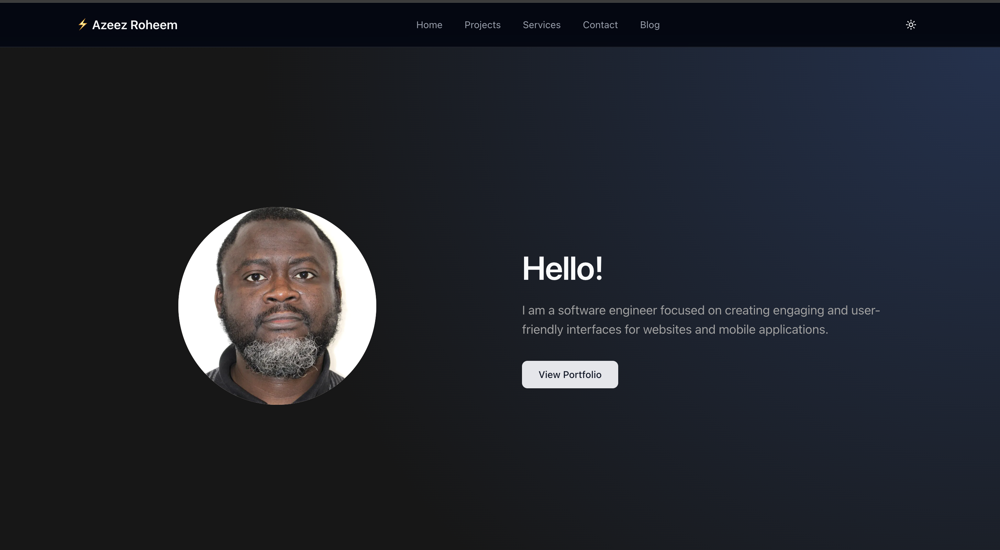
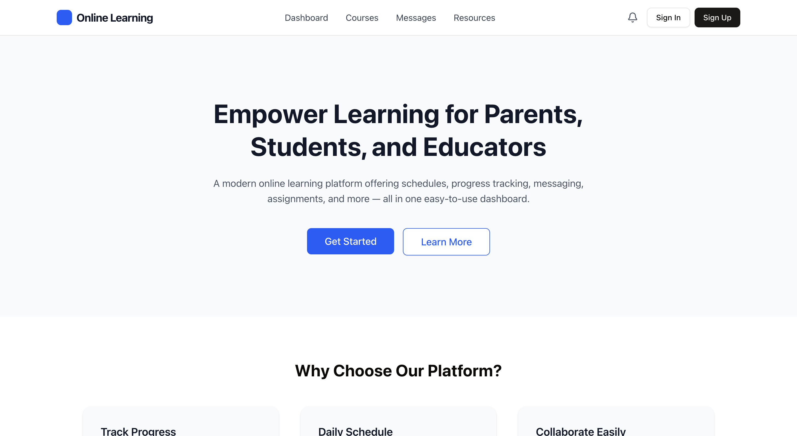

  
  
  
  
  

Hello! I'm Azeez, I am an AI-enabled full stack engineer building intelligent SaaS platforms that help SMEs automate operations and unlock revenue growth.

Over the past year, I have:

• Designed and launched AI-powered workflow systems integrating LLM APIs
 • Reduced manual resume tailoring time by up to 70% through automation
 • Built full-stack SaaS products using Next.js, Node.js & MongoDB
 • Implemented subscription billing systems and production-ready architectures
 • Automated invoicing and administrative processes for freelancers and SMEs

My focus is on building scalable, revenue-driven systems that transform repetitive business workflows into intelligent, AI-assisted processes.

See [my website](https://azeezroheem.dev) for more information!

<h1 align="center">Projects</h1>
<table bordercolor="#66b2b2">
  <td width="50%" valign="top">
      <h3 align="center">SakinaMatch</h3>
         
        
         
        

          
    
  
      

        
<strong>Next.js, TypeScript, React, Tailwind, Radix, Framer Motion, NextAuth, Postgres, Stripe, Resend, Upstash Redis, Vercel and Cloudinary</strong> - SakinaMatch is exclusively for Muslims seeking Nikah (marriage). Every member is verified by our team. Matches are prepared by a real person — not just an algorithm — and revealed only after your profile is approved.

    </td>
  <td width="50%" valign="top">
      <h3 align="center">Resume Tailor</h3>
         
      
         
        

          
  
  
      

        
<strong>
          React, OpenAI, Next.js, and Tailwind
        </strong> - Tailor your resume to any job in 30 seconds. Upload your PDF, paste any job description, and get a perfectly tailored resume — AI rewrites your bullets to match exactly what the employer is looking for..

    </td>
  <tr>
    <td width="50%" valign="top">
      <h3 align="center">Journal App</h3>
         
        
         
        

          
    
  
      

        
<strong>Next, Tailwind, React, & Postgres</strong> - Insight Journal App is a web application that contain the details of personal journal. It is a full-stack application. Writing and editing the details of personal journal for easy referencing.

    </td>
     <td width="50%" valign="top">
      <h3 align="center">Nanocrafts</h3>
         
      
         
        

          
  
  
      

        
<strong>
          HTML5, CSS3, Javascript, Next.js, Tailwind and Shadcn
        </strong> - Nanocrafts is a software consulting company. They build websites and web applications. They utilize modern technologies and resources to build applications.

    </td>
  </tr>
  
  <tr>
    <td width="50%" valign="top">
      <h3 align="center">AzeezRoheem</h3>
       
        
       
        

  
  
      

        
<strong>HTML5, CSS3, Javascript, Next.js, Tailwind and Shadcn</strong> - Portfolio Site including links to my projects and ways to get in contact with me.

    </td>
     <td width="50%" valign="top">
      <h3 align="center">Online Learning App</h3>
         
        
         
        

          
    
  
      

        
<strong>HTML5, CSS, Node.js, Express.js, & MongoDB</strong> - Online Learning App is a web application where students and teachers interact to study and review lessons. It is a full-stack application.

    </td>
    </tr>
</table>

<h1 align="center">Technologies</h1>

    
    
    <!-- 
     -->
    
    
    
    
    <!--  -->
    <!-- 
     -->
    
    
    
    
    
    
    
    
    
    
    

---

<h1 align="center">Connect</h1>

  
  
  
  
  

